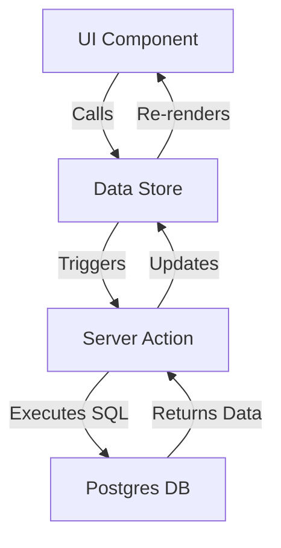

# AAWSA Billing Portal - Comprehensive Training & Technical Guide

## 1. Executive Summary
The AAWSA Billing Portal is a next-generation enterprise application designed for the Addis Ababa Water and Sewerage Authority. It automates the end-to-end lifecycle of water utility management, from field meter readings to complex billing calculations and AI-driven customer support.

---

## 2. Technical Architecture Deep-Dive

### 2.1. The Modern Web Stack
- **Next.js 15 (App Router)**: Utilizing Server Components for fast initial loads and Client Components for interactive forms.
- **Postgres Database**: A robust relational schema with strict data integrity, hosted in a high-availability environment.
- **Node.js Runtime**: Powering the backend logic via Next.js Server Actions, eliminating the need for a separate API layer in many cases.

### 2.2. Data Flow Architecture
The application uses a "Client-Side Store with Server Action Sync" pattern:
1. **Server Actions** (`src/lib/actions.ts`): Direct, type-safe database calls performed on the server.
2. **Data Store** (`src/lib/data-store.ts`): A client-side state manager that caches server data and provides real-time updates to UI components.
3. **Optimistic UI**: Changes are often reflected in the UI immediately, then synchronized with the database in the background.

---

## 3. Functional Modules Detail

### 3.1. Admin Module: System Governance
The Admin module is designed for senior management and system administrators.

#### Key Workflows:
- **Branch Strategy**: Managers define physical branches. Every staff member and customer is linked to a branch, allowing for decentralized management and isolated reporting.
- **Tariff & Billing Logic**:
    - **Tiered Rates**: Water consumption is billed in tiers (e.g., first 7m³ at rate X, next 13m³ at rate Y).
    - **VAT & Maintenance**: Automatic application of VAT (subject to consumption thresholds) and maintenance percentages.
    - **Meter Rent**: Automatic calculation based on meter diameter stored in a JSONB map.

#### Data Governance:
- **Recycle Bin**: Uses a `is_deleted` flag (soft delete) to ensure that no data is permanently lost without an explicit admin purge.
- **Security Logs**: Every critical action (password change, tariff update, data export) is logged with a timestamp and the acting staff ID.

### 3.2. Staff Module: Operations Excellence
Designed for the boots-on-the-ground team, from meter readers to billing clerks.

#### The Meter Reading Lifecycle:
1. **Assignment**: Readings are grouped by **Routes** and **Walk Orders**.
2. **Capture**: Staff enter readings manually or upload batch CSV files collected from digital readers.
3. **Validation**: The system automatically flags "Difference Usage" (discrepancy between Bulk meters and the sum of Individual meters) for investigation.
4. **Approval**: A billing manager reviews the readings. Once approved, the data is pushed to the billing generation stage.

#### Bill Management:
- **Cycle Control**: Bills are generated monthly.
- **Penalty Logic**: Automatic calculation of penalties for late payments based on the current tariff configuration.
- **Workflow State**: Bills move from `Pending` -> `Approved` -> `Paid`/`Unpaid`.

### 3.3. AI & Intelligent Automation

#### 3.3.1. Genkit Flow: The Chatbot Helper
The AI Chatbot uses **Retrieval-Augmented Generation (RAG)**:
- **Retrieval**: It scans the Knowledge Base articles for relevant text snippets.
- **Augmentation**: It feeds these snippets into a Gemini 2.0 Flash model.
- **Generation**: The model generates a human-readable answer grounded *only* in the authority's own documentation.

#### 3.3.2. AI Report Assistant
Allows managers to generate complex data views using natural language.
- **Tool Calling**: The AI understands a query like "Who hasn't paid in Kality?" and automatically triggers the `getBills` tool with the correct branch and status filters.

---

## 4. Database Schema & Migration Strategy

### 4.1. Core Entities
- **tariffs**: Version-controlled rates with effective dates.
- **bulk_meters** & **individual_customers**: The heart of the asset management.
- **bills**: The financial ledger of the authority.
- **staff_members**: User accounts with `role_id` and granular permissions.

### 4.2. Migration System
- **Location**: `database/migrations/`
- **Pattern**: Sequential SQL files (e.g., `001_initial.sql`, `002_rbac_setup.sql`).
- **Safety**: Each migration is designed to be idempotent (using `IF NOT EXISTS`) to prevent errors during multi-environment deployments.

---

## 5. Deployment & Maintenance
- **Environment Variables**: Managed via `.env` (DB credentials, Genkit API keys).
- **Build Process**: `npm run build` generates a highly optimized standalone Next.js server.
- **Scripts**: Located in `scripts/`, including diagnostics for checking DB connectivity and tools for schema dumping.
